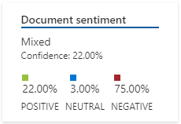
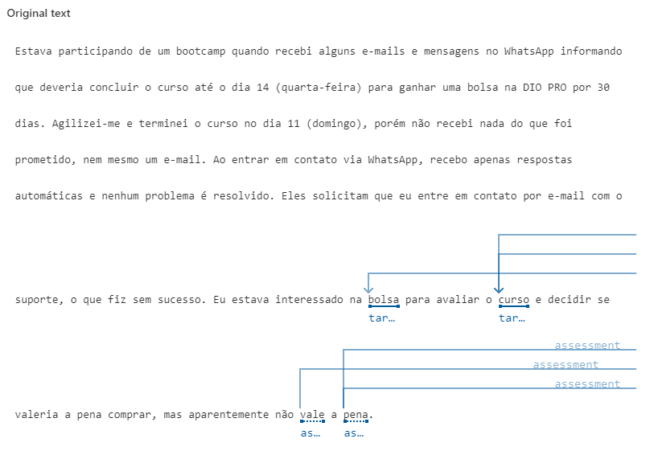
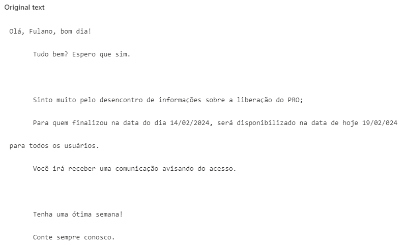

# 🔍 Exemplo Prático

Foi extraído do site [reclameaqui.com.br](https://www.reclameaqui.com.br/empresa/digital-innovation-one/) uma reclamação e sua resposta sobre a plataforma [DIO.me](https://web.dio.me/). O serviço de Linguagem identificará frases-chave, determinar quais avaliações são positivas ou negativas, e analisar o texto por menções de entidades conhecidas.

### Análise de Sentimentos e Mineração de Opiniões com Language Studio
   1. Acesse o [Language Studio](https://language.cognitive.azure.com/?azure-portal=true) para começar a análise.
   2. Na interface do Language Studio, selecione a guia `Classify text` e então o bloco `Analyze sentiment and mine opinions`.
   3. Selecione o idioma apropriado para a análise.
   4. Escolha um recurso criado no Azure.
   5. Digite ou cole o texto que você deseja analisar na área designada.
   6. Assinale a caixa de seleção para reconhecer o uso do recurso do Azure.
   7. Execute a análise e aguarde os resultados.
  
### Input

- **Texto reclamação**:
    
    >
      Estava participando de um bootcamp quando recebi alguns e-mails e mensagens no WhatsApp informando que deveria concluir o curso até o dia 14 (quarta-feira) para ganhar uma bolsa na DIO PRO por 30 dias. Agilizei-me e terminei o curso no dia 11 (domingo), porém não recebi nada do que foi prometido, nem mesmo um e-mail. Ao entrar em contato via WhatsApp, recebo apenas respostas automáticas e nenhum problema é resolvido. Eles solicitam que eu entre em contato por e-mail com o suporte, o que fiz sem sucesso. Eu estava interessado na bolsa para avaliar o curso e decidir se valeria a pena comprar, mas aparentemente não vale a pena.
    >
  
- **Análise e mineração**:
  
  
  

### Output

- **Texto resposta**:
    
    >
      Olá, Fulano, bom dia!
      Tudo bem? Espero que sim.

      Sinto muito pelo desencontro de informações sobre a liberação do PRO;
      Para quem finalizou na data do dia 14/02/2024, será disponibilizado na data de hoje 19/02/024 para todos os usuários.
      Você irá receber uma comunicação avisando do acesso.

      Tenha uma ótima semana!
      Conte sempre conosco.
    >
  
- **Análise e mineração**:

    
    